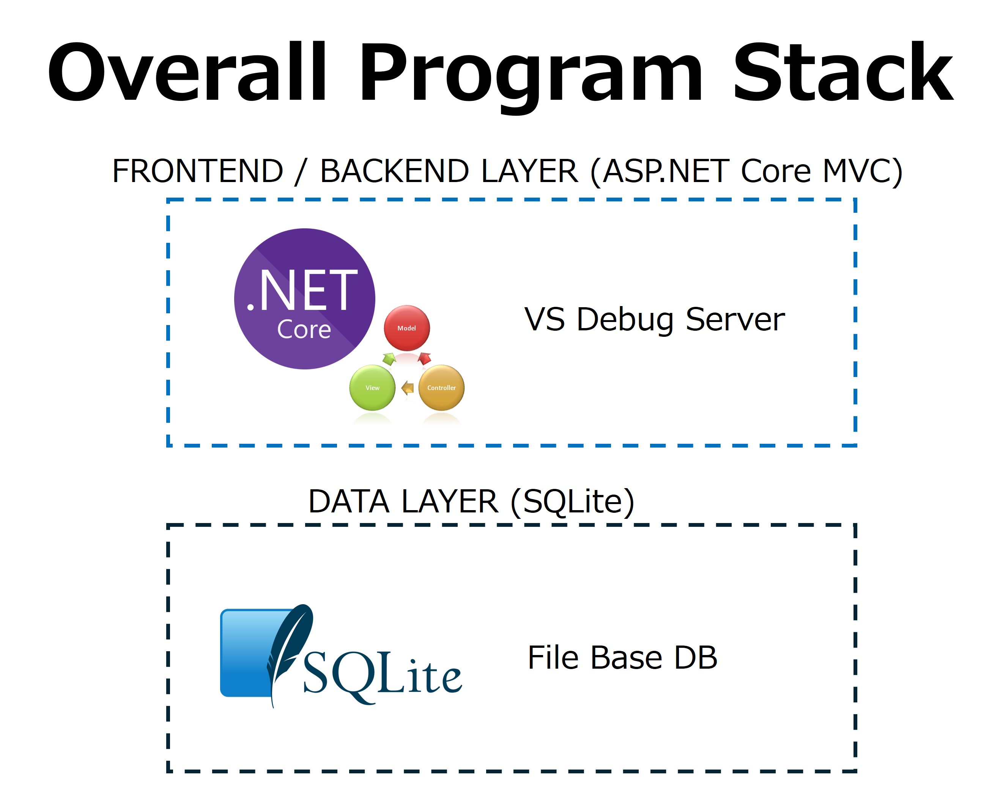

<!-- filepath: docs_dotnet/2_BeforeGettingStarted/README_JA.md -->
# はじめる前に

[前へ - モナの夢を実現する物語](../1_Story/README_JA.md) | [次へ - プロジェクト作成とSQLite導入](../3_CreateProjectAndDB/README_JA.md)

## このワークショップで作るものの全体像

1. ASP.NET Core MVC（.NET 10）プロジェクト作成とSQLite導入
2. DTO/DbContext/初期データ投入などDBレイヤーの実装
3. データベースに接続しWeb UIやREST APIを公開するMVCアプリケーションの実装
4. 単体テスト（xUnit）
5. 学びとベストプラクティス

## 開発環境と .NET バージョンについて

このワークショップは **Visual Studio 2026 + .NET 10（LTS）** をメイン環境としています。

| 環境 | 推奨 .NET バージョン | 備考 |
|------|---------------------|------|
| **Visual Studio 2026** | .NET 10（LTS） | 本ワークショップのメインパス |
| **Visual Studio Code**（C# Dev Kit） | .NET 10（LTS） | VS Code でも実施可能 |
| **Visual Studio 2022**（v17.14.5 以降） | .NET 8（LTS） | VS2022 では .NET 10 が未サポートのため .NET 8 を使用 |

> **VS2022 + .NET 8 をご利用の方へ:** 各ステップのプロンプトやコマンドで `.NET 10` と記載されている箇所は `.NET 8` に読み替えてください。主な技術的差異は以下のとおりです：
>
> | 項目 | .NET 10 | .NET 8 |
> |------|---------|--------|
> | ターゲットフレームワーク (TFM) | `net10.0` | `net8.0` |
> | EF Core パッケージバージョン | 10.x | 8.x |
> | `dotnet-ef` ツールバージョン | 10.x | 8.x |
> | `dotnet new` テンプレート | .NET 10 既定 | .NET 8 既定 |
>
> 技術的に差異がある箇所には、各ステップ内で具体的な補足を記載しています。

## このワークショップの対象者

以下の条件に当てはまる方に最適です：
- Copilot 101の基礎トレーニングを受講済み、またはGitHub Copilotに慣れている方
- .NET 10 (ASP.NET Core MVC)とファイルベースDB（SQLite）を含むフルスタックWeb開発に興味がある方

## 前提条件

このワークショップを進めるには、以下の環境が整っていることを確認してください。

- Copilotライセンスへのアクセス
- Copilot for Businessライセンス付きのCopilot Chatへのアクセス
- 以下のいずれかの開発環境：
  - **推奨:** Visual Studio 2026 + .NET 10 SDK
  - VS Code（C# Dev Kit 拡張機能）+ .NET 10 SDK でも実施可能
  - **VS2022 利用者向け:** Visual Studio 2022 のバージョン 17.14.5 以降 + .NET 8 SDK
- dotnet-ef ツールがインストールされていること
- Windowsの場合はGit CLI、Mac/Linuxの場合はターミナルでgitが使えること

## 期待される成果

このワークショップの終了時には、.NET 10 (ASP.NET Core MVC) バックエンドとSQLiteファイルデータベースレイヤーをGitHub Copilotを活用して構築できるようになります。

## 推奨フォルダ構成

以下のように、`app` ディレクトリ中心の構成を推奨します：
- `app` - .NET 10 (ASP.NET Core MVC) アプリケーション（コントローラー、モデル、ビュー、DBファイルを含む）

[前へ - モナの夢を実現する物語](../1_Story/README_JA.md) | [次へ - プロジェクト作成とSQLite導入](../3_CreateProjectAndDB/README_JA.md)
