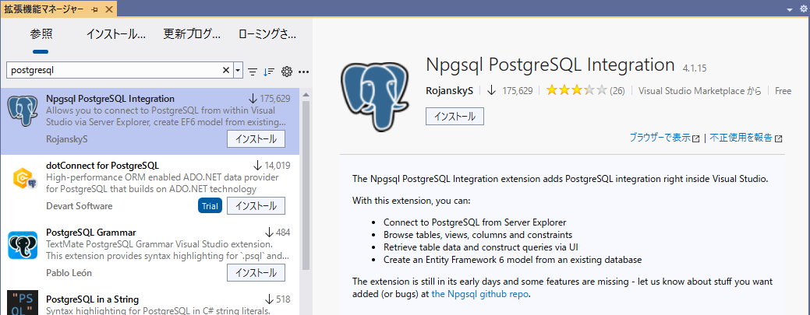
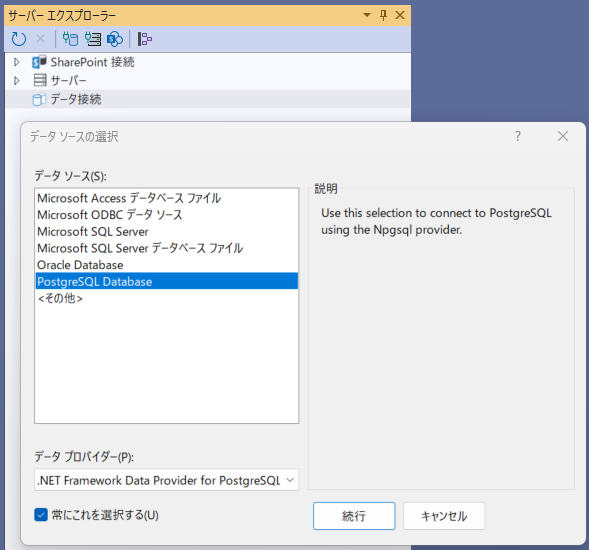
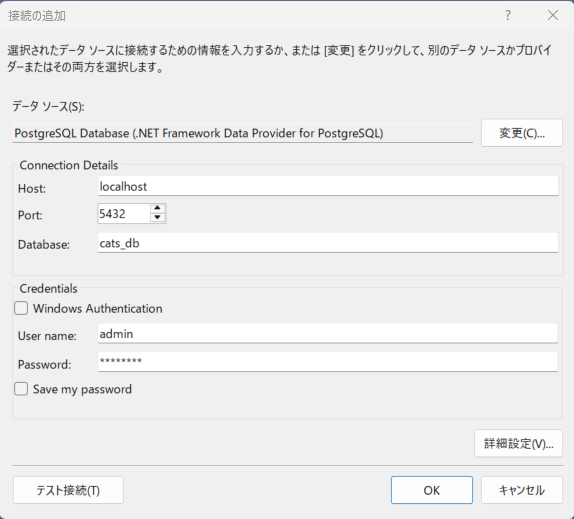
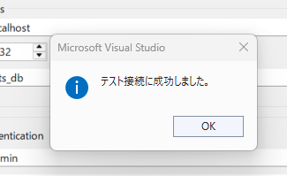
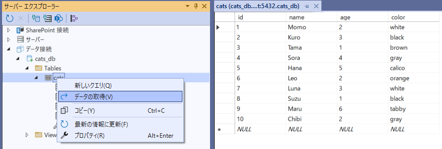

<!-- filepath: docs_dotnet/3_BuildPostgreSQL/README_VS2022_JA.md -->
# PostgreSQLデータベースレイヤーを構築しよう

[前へ - はじめる前に](../2_BeforeGettingStarted/README_JA.md) | [次へ - PostgreSQLパッケージをGitHub Packagesにデプロイ](../4_StoringPostgreSQLImageRegistry/README_JA.md)

> この例では、`database` ディレクトリ内で作業を始めることを推奨します。

**Visual Studio Chat** またはお好みのCopilot Chatを開き、次のプロンプトを入力してください。

```
ローカル環境で動作するDockerfileを作成したいです。以下の条件でお願いします：

- 「cats」という名前のPostgreSQLテーブルを新規作成。SQLファイル名は 'create-data.sql'
- 「cats」テーブルに10件以上のランダムな猫データを挿入
```

このプロンプトで、Dockerfile・SQLスクリプト・ビルド＆実行手順がCopilotから生成されます。まずは**適用**オプションでDockerfileと`create-data.sql`を作成しましょう。


> **TIP:**  
> ファイル作成後、たとえばcreate-data.sqlのcatsをdogsに変えたり、insert文を削除して「10件のランダムデータを挿入して」と再度Copilotに依頼するなど、ランダムな変更を加えてCopilotの自動生成力を体験してみましょう。

次にDockerfileを使ってデータベースをビルドします。ビルド前にDockerfileの内容（接続文字列やパスワード、SQLファイル名など）を確認・修正しましょう。

コンテナ名は `custom-database-layer` など分かりやすいものに変更するのがおすすめです。Dockerfileのあるディレクトリで以下のコマンドを実行します。

```pwsh
docker build -t custom-database-layer:1.0 .
```


イメージが作成されたか確認します：

```pwsh
docker images
```

Copilot Chatはイメージの実行方法も教えてくれます。停止や削除がしやすいように以下のようなオプションを追加しましょう：

```pwsh
docker run -p 5432:5432 --rm --detach --interactive --name custom-database-layer -d custom-database-layer:1.0
```

エラーが出た場合は[トラブルシューティングガイド](../TroubleshootingGuide/README_JA.md)を参照してください。コンテナが起動しているかは次のコマンドで確認できます：

```pwsh
docker ps
```

データベースレイヤーが動作したら、Visual StudioのPostgreSQL拡張機能などでデータを確認できます。  

Npgsql PostgreSQL Integration をインストールをインストールします。VS の再起動が必要です。



サーバーエクスプローラーなどからデータソースを追加します。





テスト接続で確認します。



cats テーブルの内容を確認します。



また、データ取得や挿入用のスクリプトも作成できます。たとえば、新しいコンソールアプリプロジェクトを作成し、Copilot Chatに次のように依頼します：

```
ローカルPostgreSQLからデータを取得して表示するC#スクリプトを作成してください。
```

このプロンプトでC#の接続サンプルが生成されます。うまく生成されない場合は、Dockerfileと`create-data.sql`の内容をプロンプトに追加します。

実行前に必要なNuGetパッケージ（例：Npgsql）がインストールされているか確認しましょう。

> **TIP:**  
> 依存パッケージの不足やバージョン不整合がよくある問題です。必ずプロジェクトで正しいNuGetパッケージが参照されているか確認してください。

Npgsqlパッケージのインストール例：

```pwsh
dotnet add package Npgsql
```

.NETプロジェクト内でデータ取得用のテストスクリプトやメソッドを作成しましょう。


作成後、接続文字列がDockerfileの内容と一致しているか確認します。


アプリやスクリプトを実行して接続・データ取得を検証します。


新規データ挿入を試したい場合はCopilot Chatに次のように依頼します：

```
データベーステーブルに新しいデータを挿入するC#スクリプトを作成してください。
```

生成されたコードをプロジェクトに追加し、実行して動作を確認しましょう。また、データが存在するか確認するメソッドも作成できます。


次のステップに進む前に、ローカル開発時はコード内にDB認証情報を記載しても問題ありませんが、共有・本番環境では必ず環境変数や安全な設定管理を利用しましょう。

> **TIP:**  
> 開発者として「動けばOK」ではなく、セキュリティ・正しさ・効率性も常に意識しましょう。Copilotはあくまでアシスタント、主役はあなたです。

DockerfileのDB接続情報を環境変数で管理したい場合は、ワークスペースのVSに戻り、Copilot Chatに次のように依頼します：

```
Dockerfileのデータベース接続文字列を、ビルド時に指定したり、環境変数に置き換えたりするにはどうすればよいですか？
```

このプロンプトで、ビルド引数(ARG)や環境変数を使ったDockerfileの例が生成されます。


Dockerfileを更新したら、コンテナを再ビルドします：

```pwsh
docker build -t custom-database-layer:2.0 --build-arg POSTGRES_USER=admin --build-arg POSTGRES_PASSWORD=P@ssw0rd --build-arg POSTGRES_DB=cats_db .
```

新しいイメージを実行：

```pwsh
docker run -p 5432:5432 --rm --detach --interactive --name custom-database-layer -d custom-database-layer:2.0
```

再度接続をテストし、成功を確認しましょう！

それでは、次のステップに進みましょう。

[前へ - はじめる前に](../2_BeforeGettingStarted/README_JA.md) | [次へ - PostgreSQLパッケージをGitHub Packagesにデプロイ](../4_StoringPostgreSQLImageRegistry/README_JA.md)
