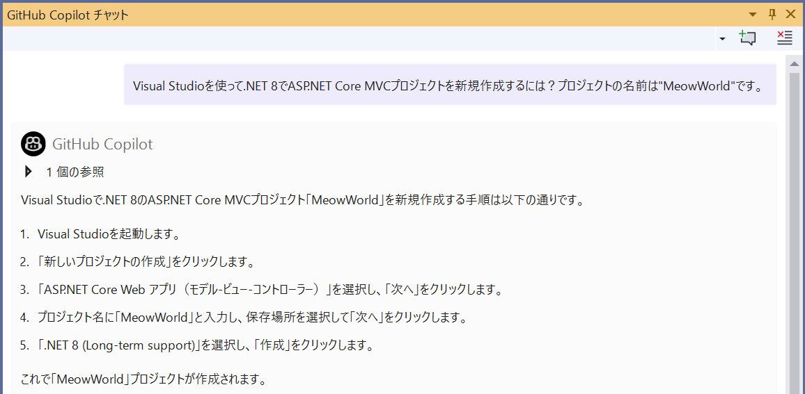
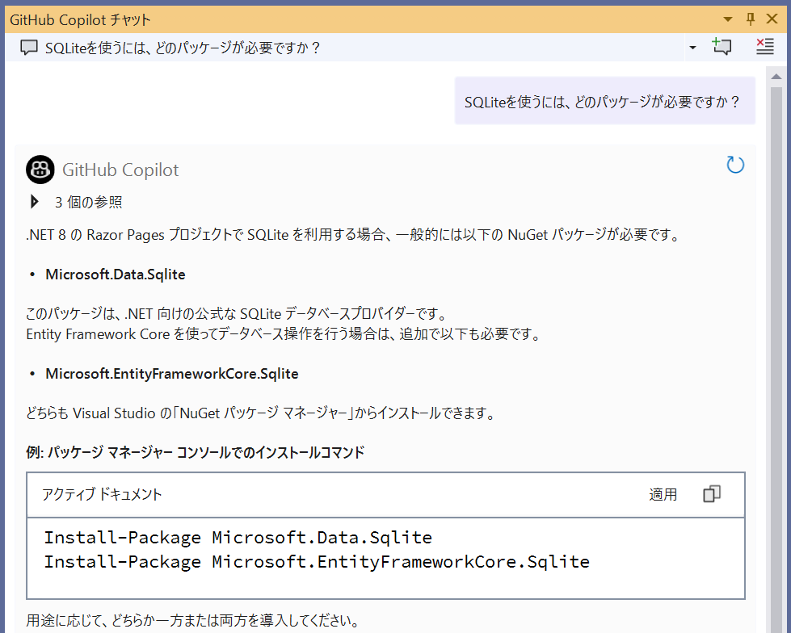
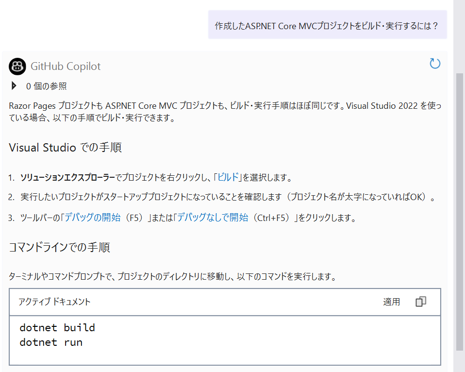

# プロジェクト作成とSQLite導入

[前へ - はじめる前に](../2_BeforeGettingStarted/README_JA.md) | [次へ - DBレイヤー（DTO/DbContext/初期データ）実装](../4_ImplementDBLayer/README_JA.md)

このステップでは、ASP.NET Core MVC（.NET 8）プロジェクトの作成と、SQLiteパッケージの導入、初回ビルド・起動確認までを行います。

---

## 1. プロジェクトの作成

まずはGitHub Copilot Chatに、以下のように質問してみましょう。

```
Visual Studioを使って.NET 8でASP.NET Core MVCプロジェクトを新規作成するには？プロジェクトの名前は"MeowWorld"です。
```

Copilotが手順を教えてくれます。



---

## 2. SQLiteパッケージの追加

以降は、前手順で作成したソリューションで実行します。

次に、Copilot Chatに以下のように質問してみましょう。
ソリューション全体についての質問のため、ソリューション全体をコンテキストに含めます。以降のプロンプトもソリューション全体を参照する必要がある場合は、コンテキストにソリューションを含めます。

> **Note:** ソリューション全体を含めるドロップダウンは、Visual Studio 2022のバージョン17.14.5以降が必要です。


```
SQLiteを使うには、どのパッケージが必要ですか？
```

Copilotが推奨パッケージや追加コマンドを教えてくれます。



---

## 3. 初回ビルド・起動確認

Copilot Chatに以下のように質問してみましょう。

```
作成したASP.NET Core MVCプロジェクトをビルド・実行するには？
```

Copilotがコマンドや実行方法を教えてくれます。



ブラウザが起動し、初期画面が表示されることを確認してください。

---

次のステップでは、DTO/DbContext/初期データ投入などDBレイヤーの実装に進みます。

[前へ - はじめる前に](../2_BeforeGettingStarted/README_JA.md) | [次へ - DBレイヤー（DTO/DbContext/初期データ）実装](../4_ImplementDBLayer/README_JA.md)
