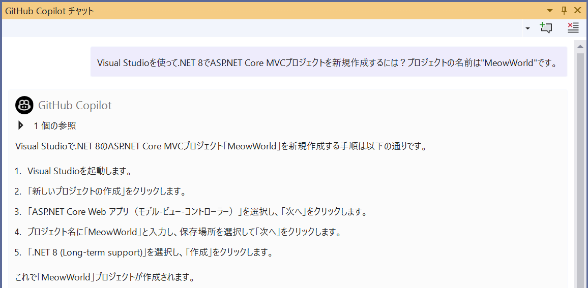
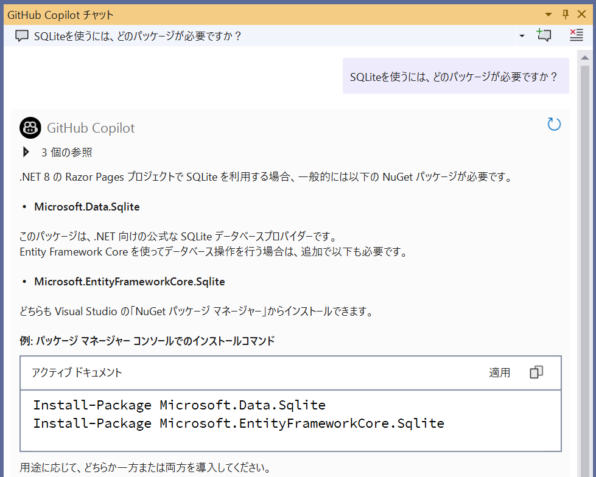
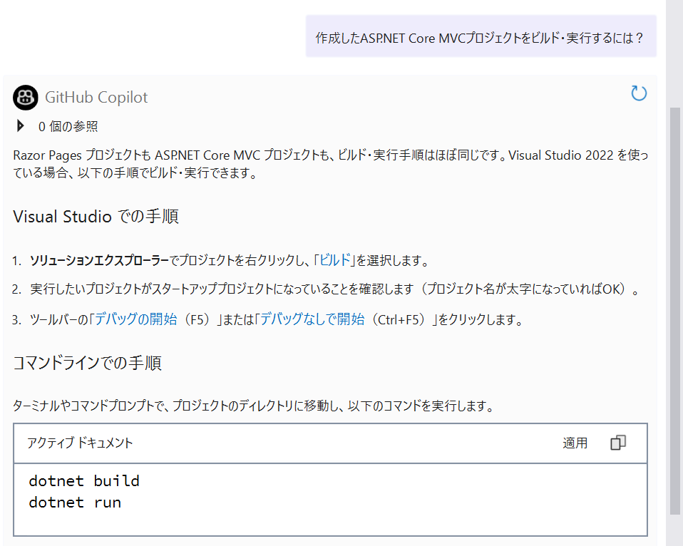

# プロジェクト作成とSQLite導入

[前へ - はじめる前に](../2_BeforeGettingStarted/README_JA.md) | [次へ - DBレイヤー（DTO/DbContext/初期データ）実装](../4_ImplementDBLayer/README_JA.md)

このステップでは、ASP.NET Core MVC（.NET 10）プロジェクトの作成と、SQLiteパッケージの導入、初回ビルド・起動確認までを行います。

---

## このステップの進め方（2つの方法）

| 方法 | 対象者 | 所要時間（目安） |
|------|--------|-----------------|
| **[方法 1: Agent モードで一括セットアップ](#agent-モードでの一括セットアップ方法-1)**（推奨・時短） | .NET 開発が初めての方・手早く環境を整えたい方 | 約 5 分 |
| **[方法 2: 手動で一つずつ実行](#1-プロジェクトの作成方法-2)** | 各ステップを理解しながら進めたい方 | 約 15〜20 分 |

> **Note:** どちらの方法でも最終的に同じプロジェクト構成になります。方法 1 で完了した場合は、方法 2 をスキップして[次のステップ](../4_ImplementDBLayer/README_JA.md)へ進んでください。

---

## Agent モードでの一括セットアップ（方法 1）

GitHub Copilot の **Agent モード**を使うと、プロジェクトの作成から NuGet パッケージの導入、ビルド確認までを 1 つのプロンプトで自動的に完了できます。

### 前提

- .NET 10 SDK がインストールされていること
- **Visual Studio 2026**、または VS Code（C# Dev Kit）がインストールされていること
- GitHub Copilot ライセンスが有効で、Copilot Chat が使用可能であること
- Copilot Chat のモード切り替えで「Agent」が選択可能であること

### 手順

1. ワークショップ用のフォルダーを作成します（例：`C:\Repos\MeowWorld-Workshop`）

   > **Note:** まだ Visual Studio のプロジェクトやソリューションは作成しません。空のフォルダーを用意するだけで OK です。Agent がこの中にプロジェクトを自動生成します。

2. Visual Studio 2026 を起動し、**「フォルダーを開く」** から手順 1 で作成したフォルダーを開きます

3. **表示 > GitHub Copilot Chat** で Copilot Chat ウィンドウを開き、入力欄のモード切り替えドロップダウンから **「Agent」** を選択します

4. 以下のプロンプトを入力して送信します：

```
.NET 10 の ASP.NET Core MVC プロジェクト "MeowWorld" を新規作成してください。
作成先は ./app ディレクトリです。
SQLite 関連の NuGet パッケージ（Microsoft.EntityFrameworkCore.Sqlite、
Microsoft.EntityFrameworkCore.Design、Microsoft.EntityFrameworkCore.Tools）を追加し、
ビルドが通ることを確認してください。
```

> **Note (.NET 8):** .NET 8 では、EF Core パッケージのバージョンを 8.x に合わせる必要があります。例：`Microsoft.EntityFrameworkCore.Sqlite` はバージョン `8.0.x` を指定してください。また、プロジェクトの TFM は `net10.0` ではなく `net8.0` になります。

5. Agent がターミナルコマンドの実行許可を求めてきたら、内容を確認して **「Continue」** を押します

6. Agent がプロジェクト作成 → パッケージ追加 → ビルド実行を順に進めます。すべて完了すると、ビルド成功のメッセージが表示されます

> **Tip:** Agent の実行中にエラーが発生した場合、Agent が自動的にエラーを解析して修正を試みます。それでも解決しない場合は、エラー内容をチャットに貼り付けて再度質問してみましょう。

### 確認

Agent によるビルドが成功したら、**デバッグ > デバッグなしで開始**、またはターミナルで以下のコマンドを実行してアプリケーションが起動することを確認します：

```bash
cd app/MeowWorld
dotnet run
```

ブラウザが起動し、初期画面が表示されれば完了です。[次のステップ](../4_ImplementDBLayer/README_JA.md)へ進んでください。

---

## 1. プロジェクトの作成（方法 2）

まずはGitHub Copilot Chatに、以下のように質問してみましょう。

```
.NET 10でASP.NET Core MVCプロジェクトを新規作成するには？プロジェクトの名前は"MeowWorld"です。
```

Copilotが手順を教えてくれます。



---

## 2. SQLiteパッケージの追加

以降は、前手順で作成したソリューションで実行します。

次に、Copilot Chatに以下のように質問してみましょう。
ソリューション全体についての質問のため、ソリューション全体をコンテキストに含めます。以降のプロンプトもソリューション全体を参照する必要がある場合は、コンテキストにソリューションを含めます。

> **Note:** Visual Studio 2026 でソリューション全体を含めるドロップダウンは、Copilot Chat のコンテキスト追加からソリューションを選択します。VS Code の場合は `#codebase` やワークスペース全体をコンテキストに含めてください。


```
SQLiteを使うには、どのパッケージが必要ですか？
```

Copilotが推奨パッケージや追加コマンドを教えてくれます。

> **Note:** コマンド形式で出力される場合、実行環境にあったものが示されているか確認してください。異なる場合は、プロンプトにOSやシェルの指定を追加してください。もしくは、カスタム指示(custom-instructions.md)を使って指定する方法も有効です。



---

## 3. 初回ビルド・起動確認

Copilot Chatに以下のように質問してみましょう。

```
作成したASP.NET Core MVCプロジェクトをビルド・実行するには？
```

Copilotがコマンドや実行方法を教えてくれます。



ブラウザが起動し、初期画面が表示されることを確認してください。

---

次のステップでは、DTO/DbContext/初期データ投入などDBレイヤーの実装に進みます。

[前へ - はじめる前に](../2_BeforeGettingStarted/README_JA.md) | [次へ - DBレイヤー（DTO/DbContext/初期データ）実装](../4_ImplementDBLayer/README_JA.md)
