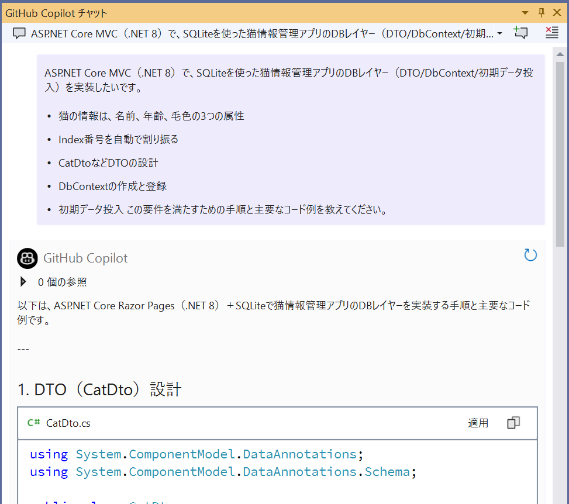
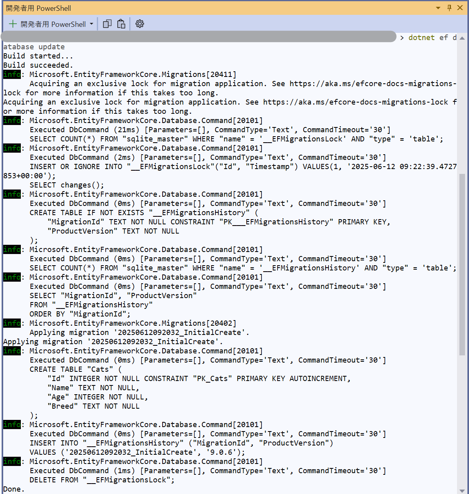

# DBレイヤー（DTO/DbContext/初期データ）実装

[前へ - プロジェクト作成とSQLite導入](../3_CreateProjectAndDB/README_JA.md) | [次へ - MVCコントローラー・ビュー実装](../5_ImplementMVC/README_JA.md)

---

## GitHub Copilot Chat推奨プロンプト（このステップ全体をまとめて質問）

まずは以下のようにCopilot Chatに質問して、DBレイヤー実装の全体手順をまとめて提案してもらいましょう。

```
ASP.NET Core MVC（.NET 8）で、SQLiteを使った猫情報管理アプリのDBレイヤー（DTO/DbContext/初期データ投入）を実装したいです。
- 猫の情報は、名前、年齢、品種の3つの属性
- Index番号を自動で割り振る
- CatDtoなどDTOの設計
- DbContextの作成と登録
- 初期データ投入
この要件を満たすための手順と主要なコード例を教えてください。
```

Copilotが全体の流れや主要なコード例をまとめて提案してくれます。



---

## 参考：細分化した質問例と模範コード

### 1. DTO（Data Transfer Object）の作成

```
ASP.NET Core MVCで猫情報を表すDTOクラス（CatDto）を作成するには？
```

```csharp
namespace MeowWorld.Models
{
    public class CatDto
    {
        public int Id { get; set; }
        public string Name { get; set; }
        public int Age { get; set; }
        public string Breed { get; set; }
    }
}
```

---

### 2. DbContextの作成

```
Entity Framework CoreでCatDtoを管理するDbContextクラス（AppDbContext）を作成するには？
```

```csharp
using Microsoft.EntityFrameworkCore;
using MeowWorld.Models;

namespace MeowWorld.Data
{
    public class AppDbContext : DbContext
    {
        public AppDbContext(DbContextOptions<AppDbContext> options) : base(options) { }
        public DbSet<CatDto> Cats { get; set; }
    }
}
```

---

### 3. DbContextの登録と接続文字列の設定

```
ASP.NET Core MVCでDbContextをDIに登録し、SQLiteの接続文字列をappsettings.jsonで管理するには？
```

```csharp
// ...existing code...
using MeowWorld.Data;
using Microsoft.EntityFrameworkCore;
// ...existing code...
var builder = WebApplication.CreateBuilder(args);
// ...existing code...
builder.Services.AddDbContext<AppDbContext>(options =>
    options.UseSqlite(builder.Configuration.GetConnectionString("DefaultConnection")));
// ...existing code...
```

`appsettings.json` の例：

```json
{
  "ConnectionStrings": {
    "DefaultConnection": "Data Source=cats.db"
  }
}
```

---

### 4. データベースの自動マイグレーションと初期データ投入

```
アプリ起動時にSQLiteのDBとテーブルを自動作成し、サンプルデータ（猫データ）を10件以上投入するには？
```

```csharp
// ...existing code...
using (var scope = app.Services.CreateScope())
{
    var db = scope.ServiceProvider.GetRequiredService<AppDbContext>();
    db.Database.Migrate();
    if (!db.Cats.Any())
    {
        db.Cats.AddRange(new[] {
            new CatDto { Name = "Mona", Age = 2, Breed = "Scottish Fold" },
            new CatDto { Name = "Leo", Age = 3, Breed = "Maine Coon" },
            // ...8件以上追加...
        });
        db.SaveChanges();
    }
}
// ...existing code...
```

マイグレーションコマンドを実行します。

```pwsh
dotnet ef migrations add InitialCreate
dotnet ef database update
```



ef ツールがインストールされていない場合は、以下でインストールし、シェルを再起動して実行します。

```pwsh
dotnet tool install --global dotnet-ef
```

---

## Advanced: データ初期化方法のリファクタリング

学習用やデモ用では「アプリ起動時にサンプルデータを投入」する方法が便利ですが、実運用やチーム開発では毎回初期化するのは一般的ではありません。

### より実践的な初期化方法を学ぼう

- **初回のみ投入**: `if (!db.Cats.Any())` で「初回のみ」サンプルデータを投入（現状の方式）
- **Seederクラス方式**: 独立したSeederクラスやサービスで、必要なときだけ明示的に初期化
- **SQLスクリプト方式**: SQLファイルを用意し、コマンドや管理画面から初期化

### Copilot Chatプロンプト（Seederクラス方式のリファクタリング）

```
ASP.NET Core MVC（.NET 8）＋SQLiteで、アプリ起動時ではなくコマンドや管理画面から明示的に初期データ投入（SeederクラスやSQLスクリプト方式）を実装したいです。学習用と実運用の違いも含めて、推奨されるリファクタリング方法とサンプルコードを教えてください。
```

具体例： Seederクラス

```csharp
// 例: Services/DbSeeder.cs
public class DbSeeder
{
    private readonly AppDbContext _context;
    public DbSeeder(AppDbContext context) { _context = context; }
    public void Seed()
    {
        if (!_context.Cats.Any())
        {
            _context.Cats.AddRange(new[] {
                new CatDto { Name = "Mona", Age = 2, Breed = "Scottish Fold" },
                // ...
            });
            _context.SaveChanges();
        }
    }
}
```

Program.cs

```csharp
// Program.cs で必要なときだけ呼び出す
using (var scope = app.Services.CreateScope())
{
    var seeder = new DbSeeder(scope.ServiceProvider.GetRequiredService<AppDbContext>());
    seeder.Seed(); // 必要なときだけ呼び出す
}
```

### Copilot Chatプロンプト（SQLスクリプト方式のリファクタリング）

```
SQLite用の初期データ投入用SQLスクリプト（例：seed.sql）を作成したいです。猫テーブル（Cats）に複数件のサンプルデータをINSERTするSQL文の例を教えてください。
```

さらに、投入方法についても質問してみましょう。

```
作成したseed.sqlを使って、cats.dbにデータを投入するにはどうすればよいですか？Windows（PowerShell）とMac/Linux（Bash）の両方の例を教えてください。
```

具体例：seed.sql

```sql
INSERT INTO Cats (Name, Age, Breed) VALUES ('Mona', 2, 'Scottish Fold');
INSERT INTO Cats (Name, Age, Breed) VALUES ('Leo', 3, 'Maine Coon');
INSERT INTO Cats (Name, Age, Breed) VALUES ('Sakura', 1, 'Munchkin');
-- 必要に応じてさらに追加
```

SQLスクリプトの投入方法

```pwsh
sqlite3 .\cats.db ".read seed.sql"
```

投入後、アプリを起動してデータが反映されているか確認しましょう。

```pwsh
sqlite3 .\cats.db "SELECT * FROM Cats;"
```

---

このように、用途に応じて初期化方法をリファクタリングできることも実践的なスキルです。

---

[前へ - プロジェクト作成とSQLite導入](../3_CreateProjectAndDB/README_JA.md) | [次へ - MVCコントローラー・ビュー実装](../5_ImplementMVC/README_JA.md)
