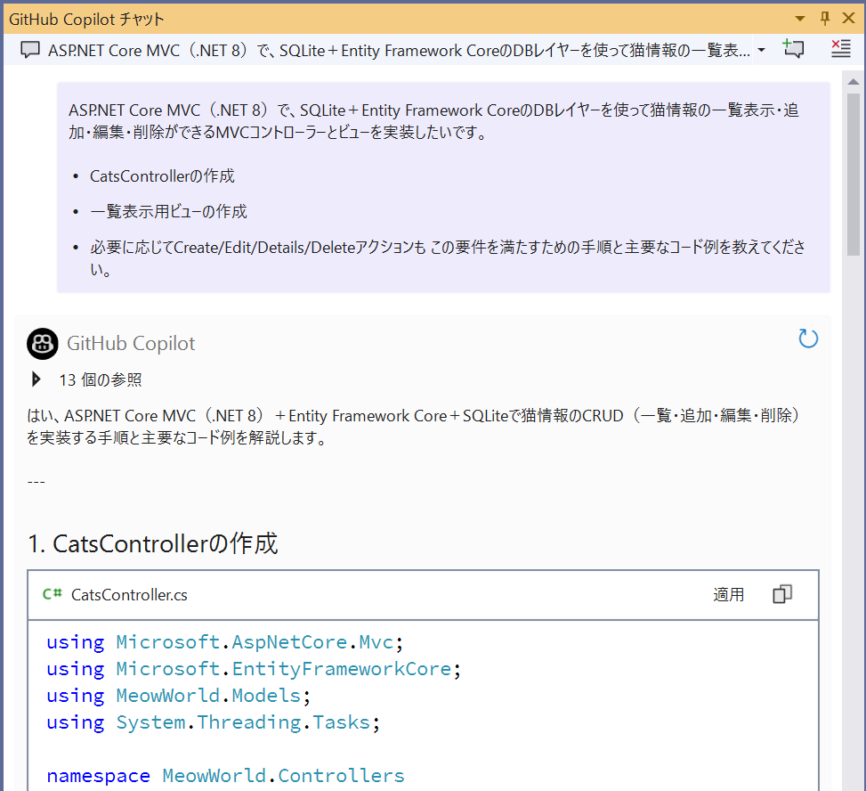
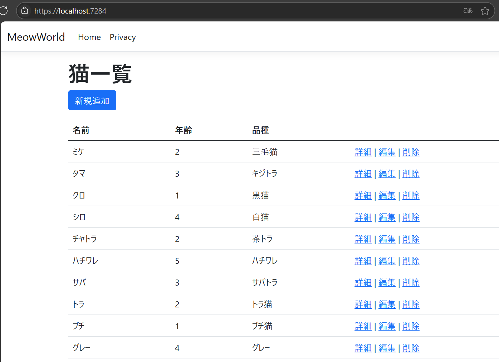
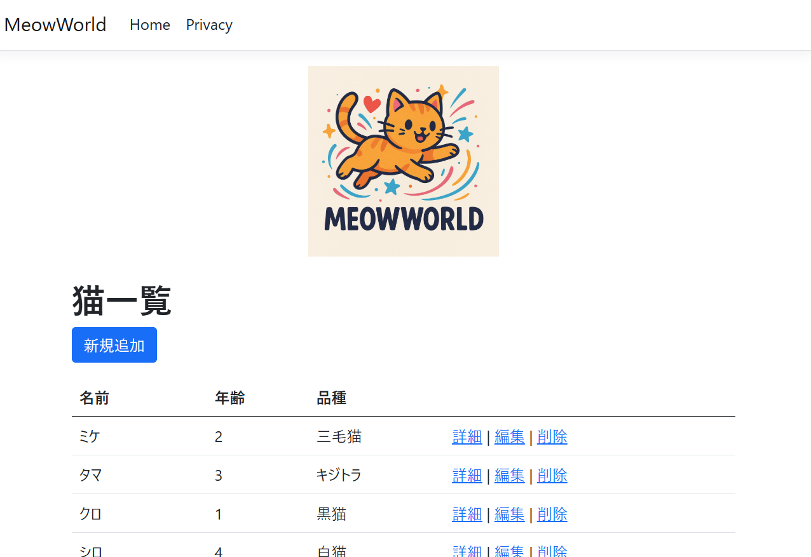

<!-- filepath: docs_dotnet/5_BuildDotNetMVC/README_JA.md -->
# MVCコントローラー・ビュー実装（SQLite/DTOパターン）

[前へ - DBレイヤー（DTO/DbContext/初期データ）実装](../4_ImplementDBLayer/README_JA.md) | [次へ - 単体テストを追加しよう](../6_UnitTesting/README_JA.md)

---

## GitHub Copilot Chat推奨プロンプト（このステップ全体をまとめて質問）

まずは以下のようにCopilot Chatに質問して、MVCコントローラー・ビュー実装の全体手順をまとめて提案してもらいましょう。

```
ASP.NET Core MVC（.NET 8）で、SQLite＋Entity Framework CoreのDBレイヤーを使って猫情報の一覧表示・追加・編集・削除ができるMVCコントローラーとビューを実装したいです。
- CatsControllerの作成
- 一覧表示用ビューの作成
- 必要に応じてCreate/Edit/Details/Deleteアクションも
この要件を満たすための手順と主要なコード例を教えてください。
```

Copilotが全体の流れや主要なコード例をまとめて提案してくれます。



> **TIP:**  
> 開発者として「動けばOK」ではなく、セキュリティ・正しさ・効率性も常に意識しましょう。Copilotはあくまでアシスタント、主役はあなたです。

コード完成後にデバッグ実行などでアプリを起動し、猫の一覧が表示されることを確認します。



> **TIP:**  
> 各ステップでCopilot Chatを活用し、よりよいプロンプトやコード提案を試してみましょう。生成されたコードは必ず内容を確認し、正しさ・セキュリティも意識してください。

### ロゴの追加

一覧画面を華やかにするために、プロンプトに以下のように入力してMeowWorldのロゴを表示する方法を尋ねます。

```
Cats Listの上に、MeowWorldのロゴを表示させたいです。どのようにすればよいですか？
```


ロゴの画像は、M365 Copilotなどを利用して出力することもできます。


ロゴを追加して実行します。



---

## 参考：細分化した質問例と模範コード

### 1. コントローラーの作成

```
猫情報の一覧表示・追加・編集・削除ができるCatsControllerを作成するには？
```

```csharp
using Microsoft.AspNetCore.Mvc;
using MeowWorld.Data;
using MeowWorld.Models;

namespace MeowWorld.Controllers
{
    public class CatsController : Controller
    {
        private readonly AppDbContext _context;
        public CatsController(AppDbContext context)
        {
            _context = context;
        }
        public IActionResult Index()
        {
            var cats = _context.Cats.ToList();
            return View(cats);
        }
        // Create/Edit/Details/Delete も必要に応じて追加
    }
}
```

---

### 2. ビューの作成

```
CatsControllerのIndexアクションに対応する一覧表示用ビュー（Views/Cats/Index.cshtml）を作成するには？
```

```html
@model IEnumerable<MeowWorld.Models.CatDto>
<h2>Cats List</h2>
<table class="table">
    <thead>
        <tr><th>Name</th><th>Age</th><th>Breed</th></tr>
    </thead>
    <tbody>
    @foreach (var cat in Model)
    {
        <tr>
            <td>@cat.Name</td>
            <td>@cat.Age</td>
            <td>@cat.Breed</td>
        </tr>
    }
    </tbody>
</table>
```

---

### 3. ルーティングの設定

```
アプリのデフォルトルートをCats/Indexに変更するには？
```

```csharp
// ...existing code...
app.MapControllerRoute(
    name: "default",
    pattern: "{controller=Cats}/{action=Index}/{id?}");
// ...existing code...
```

---

### 4. 動作確認

```
アプリを起動し、猫リストが表示されることを確認するには？
```

---

[前へ - DBレイヤー（DTO/DbContext/初期データ）実装](../4_ImplementDBLayer/README_JA.md) | [次へ - 単体テストを追加しよう](../6_UnitTesting/README_JA.md)
