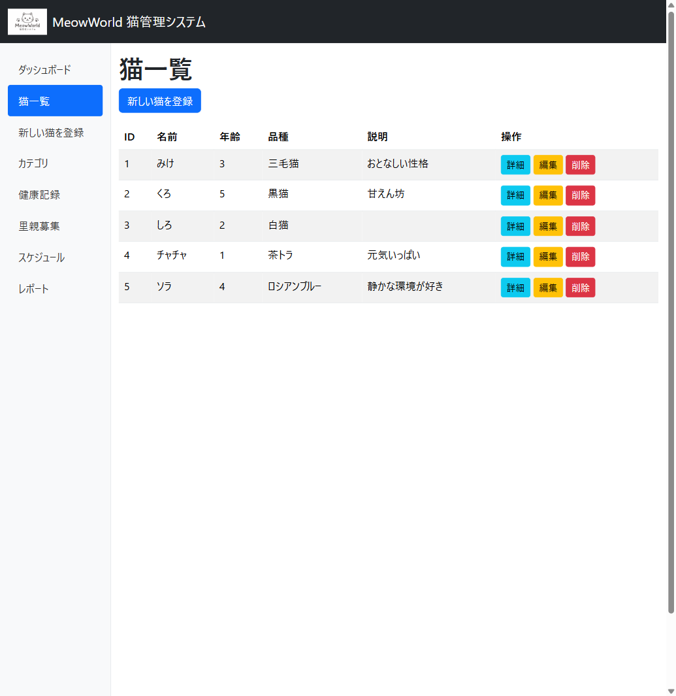

# MVC 実装 + Vision

[前へ - DB レイヤー実装](../5_ImplementDBLayer/README_JA.md) | [次へ - Token 節約とコンテキスト管理](../7_TokenManagement/README_JA.md)

このステップでは、コントローラーとビューを実装します。さらに、Copilot の **Vision 機能**（画像認識）を使って、ワイヤーフレーム画像から UI を生成する体験をします。

---

## 1. CRUD コントローラーの生成（.prompt.md 活用）

Step 4 で作成した再利用可能プロンプトを使います。

> 🕵️ **Agent モード** — `/` を入力し `create-crud-controller` を選択

```
/create-crud-controller Cat エンティティ（Id, Name, Age, Breed, Description, CreatedAt）
```

> **ポイント:** `.prompt.md` を使うことで、CRUD コントローラーの構造が毎回一貫したものになります。別の Entity を追加する場面でも同じプロンプトを再利用できます。

### Agent に残りの作業を任せる

コントローラーが生成されたら、追加の指示を出します：

> 🕵️ **Agent モード**

```
CatsController の全ビュー（Index, Details, Create, Edit, Delete）も作成して、
ナビゲーションメニューに「猫一覧」リンクを追加してください。
ビルドと動作確認もお願いします。
```

---

## 2. Vision を使った UI 実装

### Vision 機能とは

Copilot は **画像を入力として受け取り**、その内容を理解してコードを生成できます。デザインカンプやワイヤーフレームを渡すだけで、対応する HTML/CSS を実装してもらえます。

### ロゴ画像の準備

ワイヤーフレームにはヘッダーに猫のロゴが含まれていますが、**GitHub Copilot はコードを生成するツールであり、画像ファイルは生成できません**。ロゴ画像は別途用意する必要があります。

#### 方法 A: M365 Copilot (Microsoft Designer) で生成（推奨）

[Microsoft Designer](https://designer.microsoft.com/) に以下のようなプロンプトで画像を生成します：

```
シンプルでかわいい猫のロゴを作成してください。
```

生成した画像を `wwwroot/images/logo.png` として保存してください。

> **ポイント:** GitHub Copilot がコード生成を担い、M365 Copilot が画像生成を担う — Microsoft の Copilot エコシステムを組み合わせた実践的なワークフローです。

#### 方法 B: リポジトリ同梱のロゴを使用

本リポジトリには事前に生成済みのロゴが含まれています。ワークスペース（`app/`）のターミナルから以下のコマンドでコピーします：

```bash
mkdir -p MeowWorld/wwwroot/images
cp ../docs/assets/logo.png MeowWorld/wwwroot/images/logo.png
```

> **Note:** `../docs/assets/` はリポジトリクローン内の `docs/assets/` を指しています（ワークスペースの一つ上の階層）。

#### 方法 C: アイコンフォント / emoji で代替

- **Bootstrap Icons:** `<i class="bi bi-emoji-smile"></i>` 等のアイコンフォントを使用
- **emoji:** ヘッダーに `🐱` を直接配置

どちらの方法でも、この後の演習に支障はありません。

---

### 演習：ワイヤーフレームからビューを再実装

1. Copilot Chat を Agent モードにします

2. チャット入力欄の **クリップアイコン（📎）** をクリックし、以下の画像を添付します：
   - リポジトリクローン内の `docs/assets/Designer.png`（ワークスペースの一つ上 → `docs/assets/`）

   > **画像が見つからない場合:** エクスプローラーで `copilot-custom-workshop-dotnet-web/docs/assets/Designer.png` を探してください。講師に確認するか、下部の「テキストベースの代替手段」を使ってください。

3. 以下のプロンプトを入力します：

> 🕵️ **Agent モード** + 🖼️ **Vision（画像添付）**

```
添付したワイヤーフレームを参考に、Views/Cats/Index.cshtml を
このデザインに近づけてください。左サイドバーのナビゲーションは
_Layout.cshtml に実装してください。
ヘッダーのロゴには wwwroot/images/logo.png を使用してください。
```

4. Copilot が画像を解析し、以下を認識して実装します：
   - ヘッダー部分のタイトル
   - 左サイドバーのナビゲーション構造
   - メインコンテンツの猫一覧テーブル
   - アクションボタン（詳細・編集・削除）

### 確認ポイント

| 画像の要素 | 期待される実装 |
|-----------|--------------|
| 左サイドバー | `_Layout.cshtml` に Bootstrap のサイドバーナビゲーション |
| 猫一覧テーブル | `<table class="table">` with `asp-action` タグヘルパー |
| アクションボタン | Details / Edit / Delete のリンクボタン |
| レスポンシブ | Bootstrap の `container-fluid` + `row` + `col` |

> **学びのポイント:** Vision を使うことで、「デザイナーが作った画面を実装する」ワークフローが劇的に効率化されます。プロンプトで細かくレイアウトを説明する必要がなくなります。

---

### テキストベースの代替手段（VS2022 / 画像がない場合）

Vision 機能が使えない環境や画像がない場合は、以下のプロンプトで同等の UI を実装できます：

<details>
<summary>テキストベースのプロンプト（クリックで展開）</summary>

> 🕵️ **Agent モード**

```
Views/Cats/Index.cshtml と _Layout.cshtml を以下の仕様で実装してください：

【_Layout.cshtml】
- ヘッダー: "MeowWorld 猫管理システム" のタイトル
- 左サイドバーナビゲーション:
  - ダッシュボード
  - 猫一覧（アクティブ）
  - 新しい猫を登録
  - カテゴリ
  - 健康記録
  - 里親募集
  - スケジュール
  - レポート
  - ユーザー管理
  - 設定
- メインコンテンツ: @RenderBody()
- Bootstrap 5 のダッシュボード風レイアウト

【Views/Cats/Index.cshtml】
- テーブルに猫一覧を表示（ID, 名前, 年齢, 品種）
- 各行に「詳細」「編集」「削除」ボタン
- 「新しい猫を登録」ボタン（テーブル上部）
```

</details>

---

## 3. 動作確認

```bash
cd MeowWorld
dotnet run
```

ブラウザで表示を確認し、以下が動作することをチェックします：

### 完成イメージ




- [ ] 猫一覧がテーブル形式で表示される
- [ ] シードデータの 5 件が表示されている
- [ ] 新規作成（Create）で猫を追加できる
- [ ] 編集（Edit）で猫の情報を変更できる
- [ ] 削除（Delete）で猫を削除できる
- [ ] 詳細（Details）で猫の情報を確認できる

---

## まとめ

このステップで体験した Copilot の機能：

| 機能 | 体験内容 |
|------|---------|
| `.prompt.md` | 再利用可能プロンプトで一貫した CRUD 生成 |
| **Vision** | ワイヤーフレーム画像から UI を自動実装 |
| Agent モード | コントローラー + ビュー + ビルド確認を一気通貫 |
| `.instructions.md` | `applyTo: "**/*.cshtml"` で Bootstrap 5 + 日本語が自動適用 |

---

[前へ - DB レイヤー実装](../5_ImplementDBLayer/README_JA.md) | [次へ - Token 節約とコンテキスト管理](../7_TokenManagement/README_JA.md)
