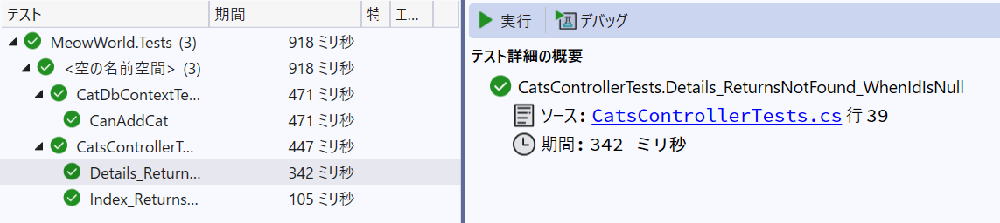

<!-- filepath: docs_dotnet/6_UnitTestingBackend/README_JA.md -->
# 単体テストを追加しよう（xUnit + SQLite/InMemory）

[前へ - MVCコントローラー・ビュー実装](../5_ImplementMVC/README_JA.md) | [次へ - 学びと振り返り](../7_LessonsLearned/README_JA.md)

---

## GitHub Copilot Chat推奨プロンプト（このステップ全体をまとめて質問）

まずは以下のようにCopilot Chatに質問して、単体テスト実装の全体手順をまとめて提案してもらいましょう。

```
ASP.NET Core MVC（.NET 8）＋SQLiteアプリで、xUnitを使ってDTOやDbContext、コントローラーの単体テストを実装したいです。
- テストプロジェクトの作成
- DbContextのテスト
- コントローラーのテスト
- テストの実行方法
この要件を満たすための手順と主要なコード例を教えてください。
```

Copilotが全体の流れや主要なコード例をまとめて提案してくれます。


---

## 参考：細分化した質問例と模範コード

### 1. テストプロジェクトの作成

```
xUnitでテストプロジェクトを作成し、EntityFrameworkCore.InMemoryを追加するには？
```

```pwsh
# ソリューションのディレクトリで実行
dotnet new xunit -n MeowWorld.Tests
dotnet add MeowWorld.Tests reference MeowWorld
dotnet add MeowWorld.Tests package Microsoft.EntityFrameworkCore.InMemory
```

---

### 2. DbContextのテスト用設定

```
AppDbContextのテストを書くには？
```

```csharp
using Microsoft.EntityFrameworkCore;
using MeowWorld.Data;
using MeowWorld.Models;
using Xunit;

public class AppDbContextTests
{
    [Fact]
    public void CanInsertCatIntoDatabase()
    {
        var options = new DbContextOptionsBuilder<AppDbContext>()
            .UseInMemoryDatabase(databaseName: "TestDb")
            .Options;
        using (var context = new AppDbContext(options))
        {
            context.Cats.Add(new CatDto { Name = "TestCat", Age = 1, Breed = "TestBreed" });
            context.SaveChanges();
        }
        using (var context = new AppDbContext(options))
        {
            Assert.Equal(1, context.Cats.Count());
        }
    }
}
```

---

### 3. コントローラーのテスト例

```
CatsControllerの単体テストを書くには？
```

```csharp
using MeowWorld.Controllers;
using MeowWorld.Models;
using Microsoft.EntityFrameworkCore;
using Xunit;
using Microsoft.AspNetCore.Mvc;

public class CatsControllerTests
{
    private CatDbContext CreateDbContext()
    {
        var options = new DbContextOptionsBuilder<CatDbContext>()
            .UseInMemoryDatabase(databaseName: Guid.NewGuid().ToString())
            .Options;
        var context = new CatDbContext(options);
        context.Cats.Add(new CatDto { Name = "Kuro", Age = 3, Breed = "KuroNeko" });
        context.SaveChanges();
        return context;
    }

    [Fact]
    public async Task Index_ReturnsViewWithCats()
    {
        // Arrange
        using var context = CreateDbContext();
        var controller = new CatsController(context);

        // Act
        var result = await controller.Index() as ViewResult;
        var model = result?.Model as List<CatDto>;

        // Assert
        Assert.NotNull(result);
        Assert.NotNull(model);
        Assert.Single(model);
        Assert.Equal("Kuro", model[0].Name);
    }
```

---

### 4. テストの実行

```
dotnet test でテストを実行するには？
```

```pwsh
dotnet test MeowWorld.Tests
```



> **Note:** ビルドエラーやテストでエラーになる場合は、修正の仕方をCopilot Chatに相談します。

```
エラーの原因を考えて解決策を提示してください。
```

追加テストの作成するように依頼します。

Copilot Chatを活用して、
- 正常・異常系の入力テスト
- CRUD操作（作成・取得・更新・削除）
- DTOマッピングのテスト
なども作成しましょう。

プロンプト例：

```
テストのカバレッジを100%になるようにテストを追加してください。また、異常系のテストも追加してください。
```


## Advanced: Copilotで改善・リファクタリング

- Moqが利用できるようにするにはどうしたらよいでしょうか。
- ASP.NET Coreの単体テストのベストプラクティスも質問してみましょう。

---

[前へ - MVCコントローラー・ビュー実装](../5_ImplementMVC/README_JA.md) | [次へ - 学びと振り返り](../7_LessonsLearned/README_JA.md)
